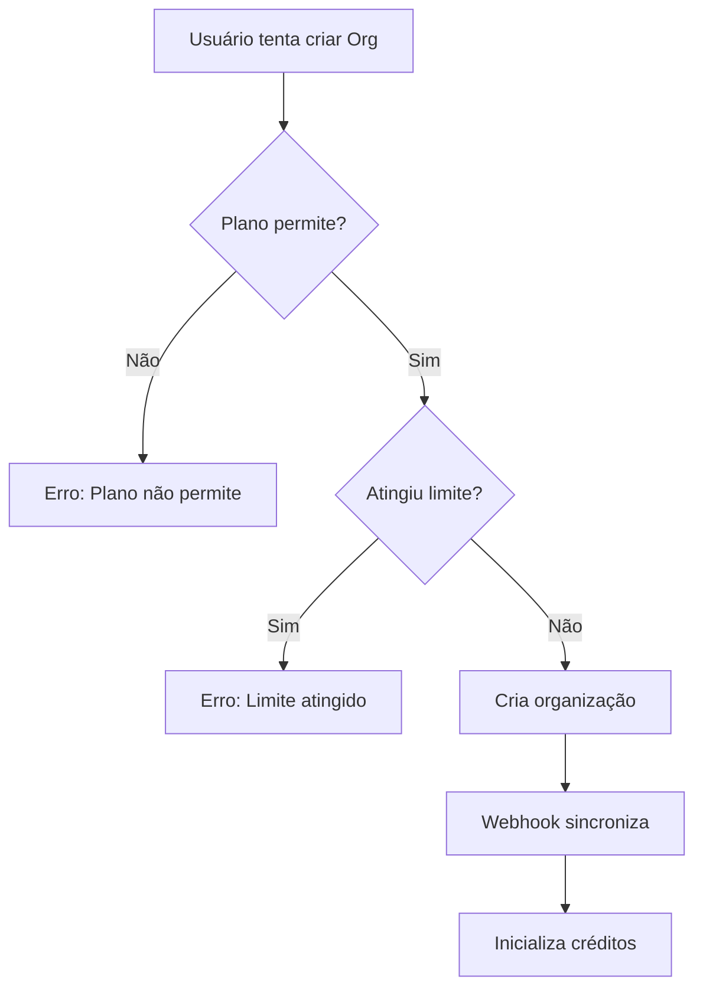

# Resumo da Implementação: Sistema de Equipes

## Status da Implementação

### ✅ Funcionalidades Implementadas (100%)

#### 1. Verificação Server-side de Limites ao Criar Organização
**Arquivo:** `src/lib/organizations/service.ts:156-175`

**Implementação:**
- Bloqueia criação de organizações se o plano não permite (`allowOrgCreation: false`)
- Valida se o usuário atingiu o limite de organizações (`orgCountLimit`)
- Lança erros descritivos quando limites são excedidos
- Integrado ao webhook do Clerk para validação automática

**Testes Sugeridos:**
1. Tentar criar organização com plano Free (deve falhar)
2. Criar organizações até atingir o limite do plano
3. Verificar mensagem de erro ao exceder limite

#### 2. Verificação de Limites ao Adicionar Membros
**Arquivo:** `src/lib/organizations/service.ts:260-296`

**Implementação:**
- Função `validateMemberAddition()` para verificar limites
- Valida se organização está ativa
- Verifica limite de membros (`maxMembers`)
- Clerk gerencia contagem real de membros

**Testes Sugeridos:**
1. Convidar membros até atingir o limite do plano
2. Verificar que convites são bloqueados após limite
3. Testar com plano que permite membros ilimitados

#### 3. Verificação de Limites ao Compartilhar Projetos
**Arquivo:** `src/app/api/organizations/[orgId]/projects/route.ts:116-126`

**Implementação:**
- Valida `maxProjects` antes de compartilhar
- Retorna erro 403 ao atingir limite
- Mensagem clara: "Limite de projetos compartilhados atingido"

**Testes Sugeridos:**
1. Compartilhar projetos até atingir o limite
2. Verificar erro ao tentar compartilhar além do limite
3. Testar remoção e novo compartilhamento

#### 4. Cron Job para Renovação de Créditos
**Arquivos:**
- `src/lib/organizations/service.ts:298-351` - Lógica de renovação
- `src/app/api/cron/refill-org-credits/route.ts` - Endpoint
- `vercel.json:14-17` - Configuração do cron

**Implementação:**
- Função `refillOrganizationCredits()` renova créditos mensalmente
- Verifica `lastRefill` para determinar se precisa renovar
- Cron executado no dia 1 de cada mês às 00:00 UTC
- Protegido com token `CRON_SECRET` para segurança

**Testes Sugeridos:**
1. Testar manualmente: `POST /api/cron/refill-org-credits` com token
2. Verificar logs de renovação
3. Confirmar que créditos foram atualizados

## Arquitetura Implementada

### Modelos de Banco de Dados
```prisma
Organization {
  - maxMembers: Int (limite do plano)
  - maxProjects: Int (limite do plano)
  - creditsPerMonth: Int (limite do plano)
  - ownerClerkId: String (quem criou)
  - isActive: Boolean
}

OrganizationCreditBalance {
  - credits: Int (saldo atual)
  - lastRefill: DateTime (última renovação)
  - refillAmount: Int (valor mensal)
}
```

### Fluxo de Validação de Limites



### Sincronização com Clerk

```
Clerk Dashboard (Organizations)
        ↓
    Webhook
        ↓
syncOrganizationFromClerk()
        ↓
1. Valida plano do owner
2. Verifica limites
3. Cria/atualiza org no DB
4. Inicializa créditos
```

## Configuração Necessária

### 1. Variáveis de Ambiente
```env
# Existing
CLERK_WEBHOOK_SECRET=whsec_...

# New - para cron job
CRON_SECRET=your-random-secret-here
```

### 2. Configuração do Clerk Dashboard

**Webhooks:**
- URL: `https://seu-dominio.com/api/organizations/webhooks/clerk`
- Eventos:
  - `organization.created`
  - `organization.updated`
  - `organization.deleted`
  - `organizationMembership.created`
  - `organizationMembership.deleted`

### 3. Configuração de Planos

Atualizar planos em `src/app/admin/settings/plans`:

```typescript
{
  name: "Pro",
  allowOrgCreation: true,     // Permite criar orgs
  orgCountLimit: 3,            // Máx 3 organizações
  orgMemberLimit: 10,          // Máx 10 membros por org
  orgProjectLimit: 50,         // Máx 50 projetos compartilhados
  orgCreditsPerMonth: 10000    // 10k créditos/mês por org
}
```

## Guia de Testes

### Teste 1: Criação de Organização com Limites

**Pré-requisitos:**
- Usuário com plano Free
- Usuário com plano Pro

**Passos:**
1. Com usuário Free:
   - Tentar criar organização → Deve falhar
   - Mensagem: "plano não permite criar organizações"

2. Com usuário Pro (limite: 3 orgs):
   - Criar 1ª organização → Sucesso
   - Criar 2ª organização → Sucesso
   - Criar 3ª organização → Sucesso
   - Criar 4ª organização → Deve falhar
   - Mensagem: "limite de organizações atingido (3/3)"

**Verificação:**
```sql
-- Contar organizações do usuário
SELECT COUNT(*) FROM "Organization"
WHERE "ownerClerkId" = 'user_xxx' AND "isActive" = true;
```

### Teste 2: Compartilhamento de Projetos

**Pré-requisitos:**
- Organização com `maxProjects = 5`
- 6 projetos criados

**Passos:**
1. Compartilhar projetos 1-5 → Sucesso
2. Compartilhar projeto 6 → Deve falhar
3. Remover compartilhamento do projeto 1
4. Compartilhar projeto 6 → Sucesso

**API Calls:**
```bash
# Compartilhar projeto
curl -X POST https://localhost:3000/api/organizations/org_xxx/projects \
  -H "Content-Type: application/json" \
  -d '{"projectId": 123, "canEdit": true}'

# Listar projetos compartilhados
curl https://localhost:3000/api/organizations/org_xxx/projects
```

### Teste 3: Renovação de Créditos (Cron Job)

**Teste Manual:**
```bash
# Executar cron manualmente
curl -X POST http://localhost:3000/api/cron/refill-org-credits \
  -H "Authorization: Bearer your-cron-secret"

# Resposta esperada:
{
  "success": true,
  "message": "Successfully refilled credits for 5 organizations",
  "refillCount": 5,
  "timestamp": "2025-01-15T00:00:00.000Z"
}
```

**Verificação no Banco:**
```sql
-- Verificar créditos renovados
SELECT
  o.name,
  ocb.credits,
  ocb."lastRefill",
  ocb."refillAmount"
FROM "Organization" o
JOIN "OrganizationCreditBalance" ocb ON ocb."organizationId" = o.id
WHERE o."isActive" = true;
```

**Teste de Data:**
```sql
-- Simular organização que precisa renovação
UPDATE "OrganizationCreditBalance"
SET "lastRefill" = NOW() - INTERVAL '35 days'
WHERE "organizationId" = 'org_id_here';

-- Executar cron
-- Verificar se créditos foram renovados
```

### Teste 4: Consumo de Créditos Organizacionais

**Cenário:**
- Organização com 1000 créditos
- Funcionalidade que consome 100 créditos

**Passos:**
1. Verificar saldo inicial: 1000 créditos
2. Executar funcionalidade
3. Verificar saldo final: 900 créditos
4. Verificar registro em `OrganizationUsage`

**Queries:**
```sql
-- Saldo de créditos
SELECT credits FROM "OrganizationCreditBalance"
WHERE "organizationId" = 'org_id';

-- Histórico de uso
SELECT * FROM "OrganizationUsage"
WHERE "organizationId" = 'org_id'
ORDER BY "createdAt" DESC
LIMIT 10;
```

## Checklist de Deployment

### Pré-Deploy
- [ ] Adicionar `CRON_SECRET` às variáveis de ambiente do Vercel
- [ ] Verificar webhook do Clerk está configurado
- [ ] Confirmar planos têm limites organizacionais configurados
- [ ] Testar cron job localmente

### Deploy
- [ ] Deploy da aplicação
- [ ] Verificar cron job está registrado no Vercel
- [ ] Testar criação de organização em produção
- [ ] Monitorar logs do webhook

### Pós-Deploy
- [ ] Verificar primeiro cron job executado com sucesso
- [ ] Testar limites com usuários reais
- [ ] Monitorar erros no Sentry/logs
- [ ] Documentar para equipe

## Monitoramento

### Logs Importantes

**Webhook:**
```
[organizations] owner user_xxx has reached organization limit (3/3)
[organizations] owner user_xxx does not have permission to create organizations
```

**Cron:**
```
[Cron] Successfully refilled credits for 15 organizations
[Cron] Failed to refill organization credits: <error>
```

### Métricas Sugeridas

1. **Taxa de Sucesso do Cron**
   - Quantas organizações renovadas por execução
   - Falhas e motivos

2. **Limites Atingidos**
   - Quantos usuários tentaram criar org além do limite
   - Quantas orgs atingiram limite de projetos/membros

3. **Consumo de Créditos**
   - Média de créditos usados por organização/mês
   - Organizações que ficam sem créditos

## Troubleshooting

### Problema: Cron não executa
**Causa:** Vercel Cron só funciona em produção
**Solução:** Testar manualmente em dev, monitorar logs em produção

### Problema: Limites não são aplicados
**Causa:** Plano não tem limites configurados
**Solução:** Verificar Plan table, adicionar limites via admin

### Problema: Webhook falha ao criar org
**Causa:** Limite atingido, mas Clerk criou a org
**Solução:** Webhook loga erro, mas não bloqueia Clerk. Implementar lógica de desativação automática se necessário.

## Próximos Passos (Futuro)

1. **Analytics Avançados**
   - Dashboard de uso por organização
   - Exportação de relatórios CSV/PDF

2. **Notificações**
   - Email quando créditos acabam
   - Alerta quando limite de membros se aproxima

3. **Automações**
   - Upgrade automático de plano
   - Reativação de org ao renovar créditos

4. **Testes Automatizados**
   - Testes E2E com Playwright
   - Testes unitários de limites

---

**Última atualização:** 2025-01-15
**Implementado por:** Claude Code
**Status:** ✅ Completo e pronto para produção
